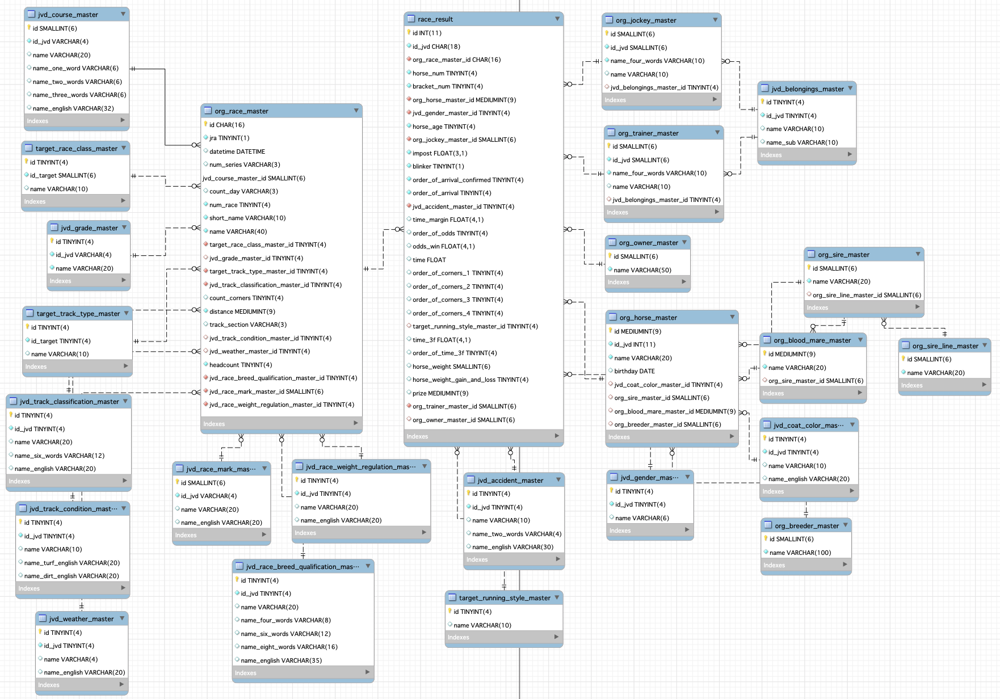

# meydan-db
JRA-VAN Target の開催成績出力 csv をデータベース (MySQL) にて管理するための論理設計を検討する。

## テーブル一覧
jvd コード、target コードの詳細は https://github.com/shuhei-tokyo/jvd-target-csv-master

テーブル名 | 内容
-- | --
jvd_course_master | jvd 競馬場コード
jvd_grade_master | jvd グレードコード
jvd_race_breed_qualification_master | jvd 競走種別コード
jvd_race_mark_master | jvd 競走記号コード
jvd_race_weight_regulation_master | jvd 重量種別コード
jvd_track_classification_master | jvd トラックコード
jvd_track_condition_master | jvd 馬場状態コード
jvd_weather_master | jvd 天候コード
jvd_accident_master | jvd 異常区分コード
jvd_gender_master | jvd 性別コード
jvd_coat_color_master | jvd 毛色コード
jvd_belongings_master | jvd 東西所属コード
target_race_class_master | target クラスコード
target_track_type_master | target トラックコード
target_running_style_master | target 脚質コード
race_result | レース結果
org_race_master | レース
org_horse_master | 競走馬
org_sire_master | 種牡馬
org_blood_mare_master | 繁殖牝馬
org_sire_line_master | 種牡馬血統タイプ
org_jockey_master | 騎手
org_trainer_master | 調教師
org_breeder_master | 生産者
org_owner_master | 馬主

## ER 図

